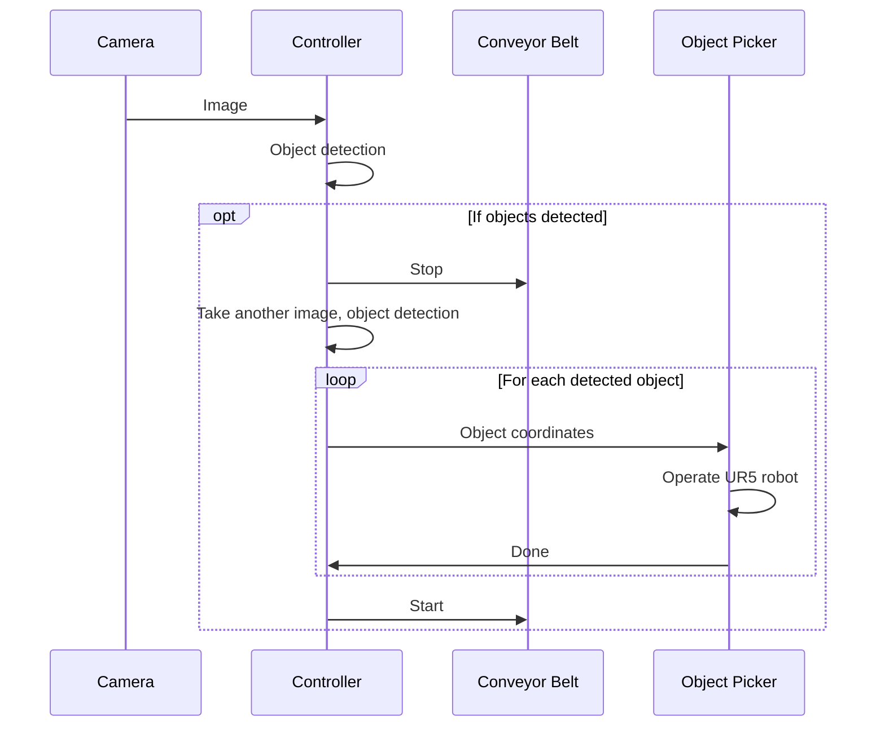

# conveyer-belt-cv

**Repository**: https://github.com/marcoross/conveyer-belt-cv

**Group project for Robotics AI. Team Members:**
- Christina Petschnig
- Elisabeth Bankl
- Sara Spreitzhofer
- Bodowin Bittner
- Marco Ross

## Introduction
The goal of the project was to simulate a conveyor belt system where an industrial robot must recognize, grasp, and sort objects of different types into designated bins based on their shape.

## Environment

After building the ROS docker container, run the following commands to install required packages
```bash
sudo apt-get update
sudo apt-get install ros-noetic-rospy ros-noetic-gazebo-ros-pkgs ros-noetic-gazebo-ros-control ros-noetic-rosgraph-msgs ros-noetic-moveit ros-noetic-tf-conversions
pip install ultralytics
```


## Build and Execute

To build the application, cd to `~/catkin_ws` and run the following commands:
```bash
catkin_make
source devel/setup.bash
```
To start the application, cd to `~/catkin_ws/src/fhtw` and run:
```bash
roslaunch conveyer-belt-cv-package/launch/project.launch 
```

## Software design

The following sequence diagram illustrates the interactions between the major ROS nodes:


The following subsections briefly describe the main ROS nodes implemented for this project.

### Controller
The controller node is implemented in the `conveyer-belt-cv-package` package in `scripts/controller.py`. It contains the main loop to collect camera images, run the object detection using a custom YOLOv8 model, and control the conveyor belt and the object picker.

### Camera
The camera is implemented in the `conveyer-belt-cv-package` package in `models/camera`. It is mounted above the conveyor belt looking directly down on the belt and takes one picture per second.

### Conveyor Belt
The conveyor belt model uses a custom gazebo plugin implemented in the `conveyer-belt-cv-package` package in `src/conveyor_belt_plugin.cpp`. To simulate a moving belt, the default friction physics of the box has been replaced with a custom collision handler that applies a force on objects laying on top of the conveyor belt, depending on the relative velocity between the object and the simulated belt.

### Object Picker
The object picker is implemented in the `ur5_moveit_config` package in `scripts/pick_objects.py`. It receives messages from the controller with object X and Y coordinates and object classification encoded in the Z coordinate. Upon reception of a message, it controls the UR5 robot to place the object in the correct box, depending on its classification. The code is based on the UR5-Pick-and-Place-Simulation project from the Github repository https://github.com/pietrolechthaler/UR5-Pick-and-Place-Simulation.

### Computer Vision model
The computer vision model is a custom `YOLOv8-obb` model embedded in the Controller node. Training data was generated using a slightly modified version of the simulation environment that can be started with the `generate_training_images.launch` launch file in the `conveyer-belt-cv-package` package. The training itself was done outside the ROS environment. The training script can be found in the `conveyer-belt-cv-package` in `src/train_yolov8_obb.py`.
